# CI/CD Documentation

This directory contains all GitHub Actions workflows and configuration for continuous integration and deployment.

## 📋 Overview

The CI/CD pipeline is organized into modular workflows that run independently and can be composed together.

## 🔄 Workflows

### Core CI Workflows

#### 1. **Backend CI/CD** (`backend.yml`)
- **Trigger**: Push/PR to backend code
- **Jobs**:
  - Build .NET solution
  - Run unit tests
  - Code quality checks (formatting, security)
  - Publish artifacts
- **Artifacts**: `web-api` (deployable package)

#### 2. **Azure Functions CI/CD** (`functions.yml`)
- **Trigger**: Push/PR to Functions code
- **Jobs**:
  - Build Functions project
  - Validate configuration files
  - Run function-specific tests
  - Publish artifacts
- **Artifacts**: `azure-functions` (deployable package)

#### 3. **Frontend CI/CD** (`frontend.yml`)
- **Trigger**: Push/PR to frontend code
- **Jobs**:
  - Lint TypeScript/React code
  - Type checking with `tsc`
  - Run Vitest tests
  - Build production bundle
  - Bundle size analysis
- **Artifacts**: `frontend-build` (dist folder)

#### 4. **ML Service CI/CD** (`ml-service.yml`)
- **Trigger**: Push/PR to ML service code
- **Jobs**:
  - Python linting (black, flake8, mypy)
  - Run pytest with coverage
  - Build Docker image
  - Security vulnerability scan
- **Docker Image**: Cached in GitHub Container Registry

### Supporting Workflows

#### 5. **Pull Request Checks** (`pr-checks.yml`)
- **Trigger**: PR opened/updated
- **Checks**:
  - PR title follows Conventional Commits format
  - PR size analysis (warns if >50 files)
  - Merge conflict detection
  - TODO/FIXME comment tracking

#### 6. **Full CI Pipeline** (`ci.yml`)
- **Trigger**: Push to main/develop, manual trigger
- **Runs**: All core workflows in parallel
- **Purpose**: Single entry point for complete validation

## 🎯 Branch Strategy

| Branch     | Purpose                  | CI Behavior                    | Deployment    |
| ---------- | ------------------------ | ------------------------------ | ------------- |
| `main`     | Production-ready code    | Full CI + artifacts            | Auto (future) |
| `develop`  | Integration branch       | Full CI + artifacts            | Manual        |
| `phase-*`  | Feature branches         | Full CI (no deployment)        | None          |
| `feature/*`| Individual features      | Full CI (no deployment)        | None          |
| `hotfix/*` | Emergency fixes          | Full CI + priority deployment  | Manual        |

## 📦 Artifacts

All workflows produce artifacts retained for **30 days**:

| Artifact Name      | Description                | Size (approx.) | Workflow     |
| ------------------ | -------------------------- | -------------- | ------------ |
| `web-api`          | .NET Web API publish       | ~50 MB         | backend.yml  |
| `azure-functions`  | Functions publish          | ~60 MB         | functions.yml|
| `frontend-build`   | React production build     | ~5 MB          | frontend.yml |
| Docker image       | ML service container       | ~800 MB        | ml-service.yml|

## 🔐 Secrets Configuration

### Required GitHub Secrets (for future Azure deployment)

| Secret Name                           | Description                          | Used By         |
| ------------------------------------- | ------------------------------------ | --------------- |
| `AZURE_CREDENTIALS`                   | Service principal JSON               | All deployments |
| `AZURE_SUBSCRIPTION_ID`               | Azure subscription ID                | All deployments |
| `AZURE_WEBAPP_PUBLISH_PROFILE`        | App Service publish profile          | backend.yml     |
| `AZURE_FUNCTIONAPP_PUBLISH_PROFILE`   | Function App publish profile         | functions.yml   |
| `AZURE_STATIC_WEB_APPS_TOKEN`         | Static Web Apps deployment token     | frontend.yml    |
| `REGISTRY_URL`                        | Container registry URL               | ml-service.yml  |
| `REGISTRY_USERNAME`                   | Container registry username          | ml-service.yml  |
| `REGISTRY_PASSWORD`                   | Container registry password          | ml-service.yml  |
| `LLAMA_API_KEY`                       | Llama API key (for integration tests)| backend.yml     |

### Setting Up Secrets

```bash
# Example: Add Azure credentials
gh secret set AZURE_CREDENTIALS --body "$(cat azure-credentials.json)"

# Example: Add Llama API key
gh secret set LLAMA_API_KEY --body "your-api-key-here"
```

## 🚀 Local Testing

### Test Workflows Locally with `act`

Install [act](https://github.com/nektos/act):
```bash
# macOS
brew install act

# Test a specific workflow
act -W .github/workflows/backend.yml

# Test PR checks
act pull_request -W .github/workflows/pr-checks.yml
```

### Run Individual CI Steps

```bash
# Backend
cd AiTradingRace.Web
dotnet restore
dotnet build --configuration Release
dotnet test

# Frontend
cd ai-trading-race-web
npm ci
npm run lint
npm run build

# ML Service
cd ai-trading-race-ml
pip install -r requirements.txt
pytest tests/
black --check app/
```

## 📊 CI Status Badges

Add to your README.md:

```markdown


```

## 🛡️ Branch Protection Rules

### Recommended Settings for `main`

```yaml
Required status checks:
  - Backend CI
  - Functions CI
  - Frontend CI
  - ML Service CI
  - Pull Request Checks

Required reviews: 1
Dismiss stale reviews: true
Require review from code owners: true
Require linear history: true
Require signed commits: false (optional)
Include administrators: true
```

### Setting via GitHub CLI

```bash
gh api repos/diegoaquinoh/ai-trading-race/branches/main/protection \
  --method PUT \
  --field required_status_checks='{"strict":true,"contexts":["Backend CI","Frontend CI","ML Service CI"]}' \
  --field required_pull_request_reviews='{"required_approving_review_count":1}' \
  --field enforce_admins=true
```

## 🔄 Deployment Strategy (Future)

### Deployment Slots (Zero-Downtime)

```mermaid
graph LR
    A[Push to main] --> B[CI Passes]
    B --> C[Deploy to Staging Slot]
    C --> D[Run Smoke Tests]
    D --> E[Swap Staging → Production]
    E --> F[Monitor]
    F --> G{Issues?}
    G -->|Yes| H[Rollback via Swap]
    G -->|No| I[Complete]
```



### Manual Deployment Trigger

```bash
# Trigger deployment workflow manually
gh workflow run backend.yml --ref main

# Check deployment status
gh run list --workflow=backend.yml --limit 5
```

## 🧪 Testing Strategy

| Test Type         | Tool               | Workflow         | Coverage Target |
| ----------------- | ------------------ | ---------------- | --------------- |
| Unit Tests        | xUnit              | backend.yml      | >80%            |
| Integration Tests | xUnit + TestServer | backend.yml      | >60%            |
| Frontend Tests    | Vitest             | frontend.yml     | >70%            |
| ML Tests          | pytest             | ml-service.yml   | >80%            |
| E2E Tests         | Playwright         | TBD (Phase 9)    | Key flows       |

## 📈 Monitoring & Alerts

### Workflow Notifications

Configure Slack/Discord webhooks for:
- ✅ Successful deployments to `main`
- ❌ Failed CI runs on `main`/`develop`
- ⚠️ Security vulnerabilities detected
- 📦 Large bundle size increases (>10%)

### Example: Slack Notification

Add to workflow:
```yaml
- name: Notify Slack on failure
  if: failure()
  uses: slackapi/slack-github-action@v1
  with:
    payload: |
      {
        "text": "❌ CI Failed: ${{ github.workflow }}",
        "blocks": [
          {
            "type": "section",
            "text": {
              "type": "mrkdwn",
              "text": "Workflow *${{ github.workflow }}* failed on `${{ github.ref_name }}`\n<${{ github.server_url }}/${{ github.repository }}/actions/runs/${{ github.run_id }}|View Run>"
            }
          }
        ]
      }
  env:
    SLACK_WEBHOOK_URL: ${{ secrets.SLACK_WEBHOOK_URL }}
```

## 🐛 Troubleshooting

### Common Issues

#### 1. **Workflow not triggering**
- Check `paths` filters match changed files
- Verify branch name matches `branches` pattern
- Ensure `.github/workflows/` files are committed

#### 2. **Tests failing in CI but passing locally**
- Check environment variables
- Verify `appsettings.json` is not .gitignored
- Ensure test database is properly configured

#### 3. **Docker build failures**
- Clear GitHub Actions cache: Settings → Actions → Caches
- Check Dockerfile syntax
- Verify base image availability

#### 4. **Artifact upload failures**
- Check artifact name uniqueness
- Verify path exists after build
- Check disk space (artifacts max 10 GB)

### Debug Mode

Enable debug logs:
```bash
gh secret set ACTIONS_RUNNER_DEBUG --body "true"
gh secret set ACTIONS_STEP_DEBUG --body "true"
```

## 📚 Resources

- [GitHub Actions Documentation](https://docs.github.com/en/actions)
- [Workflow Syntax](https://docs.github.com/en/actions/using-workflows/workflow-syntax-for-github-actions)
- [Caching Dependencies](https://docs.github.com/en/actions/using-workflows/caching-dependencies-to-speed-up-workflows)
- [Docker Build Push Action](https://github.com/docker/build-push-action)

## 🔄 Maintenance

### Weekly Tasks
- [ ] Review failed workflow runs
- [ ] Update action versions (Dependabot)
- [ ] Check artifact storage usage
- [ ] Review and close stale PRs

### Monthly Tasks
- [ ] Audit GitHub secrets rotation
- [ ] Review branch protection rules
- [ ] Clean up old artifacts
- [ ] Update CI/CD documentation

---

**Last Updated**: January 20, 2026  
**Owner**: @diegoaquinoh  
**Phase**: 8 - CI/CD Setup (No Azure Deployment)
